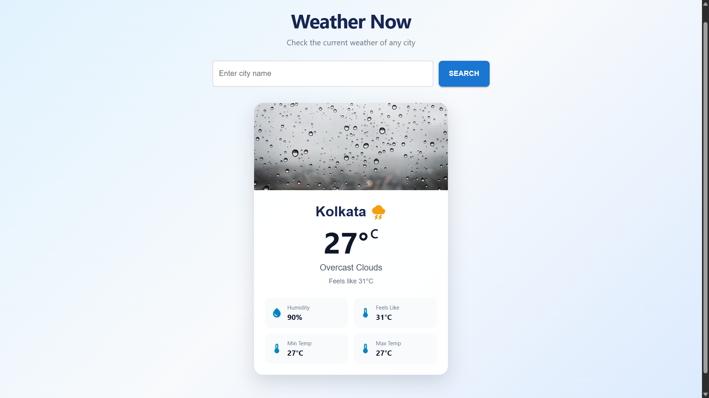
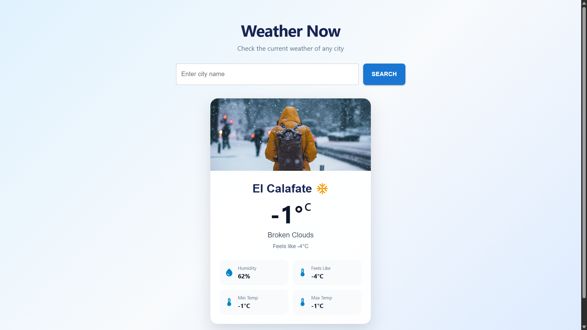
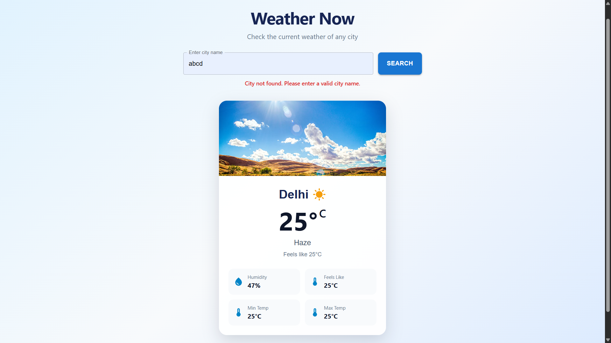

# Weather Widget

A responsive weather application built using React and Material UI. The application fetches real-time weather information from the OpenWeather API based on the city entered by the user.

## Preview

The Weather Widget provides a clean and responsive interface for searching and viewing current weather conditions for different cities.

## Screenshots

### Weather Widget



### Different Weather Condition



### Error Handling



## Features

- Search weather by city name
- Real-time weather information
- Current temperature
- Feels-like temperature
- Minimum and maximum temperature
- Humidity information
- Weather condition description
- Dynamic weather images based on weather conditions
- Weather icons using Material UI Icons
- Loading indicator while fetching weather data
- Error handling for invalid city names
- Responsive design for different screen sizes
- Clean and modern user interface
- API key stored using environment variables

## Tech Stack

- React
- JavaScript
- Material UI
- CSS
- OpenWeather API
- Vite

## API

This project uses the OpenWeather Current Weather API to retrieve real-time weather information.

The API key is stored in a `.env` file and is not included in the repository.

## Installation

### 1. Clone the repository

```bash
git clone https://github.com/Shain-12/Weather-widget-react.git
```

### 2. Navigate to the project directory

```bash
cd Weather-widget-react
```

### 3. Install dependencies

```bash
npm install
```

### 4. Configure the API key

Create a `.env` file in the root directory:

```env
VITE_WEATHER_API_KEY=your_openweather_api_key
```

### 5. Start the development server

```bash
npm run dev
```
